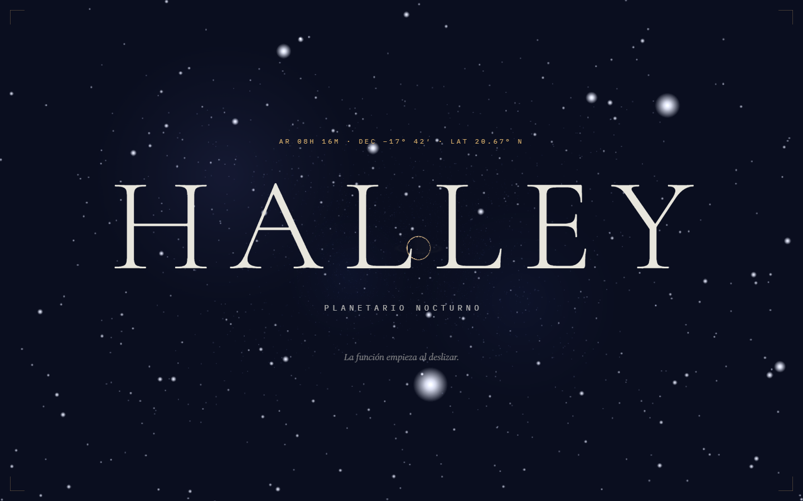
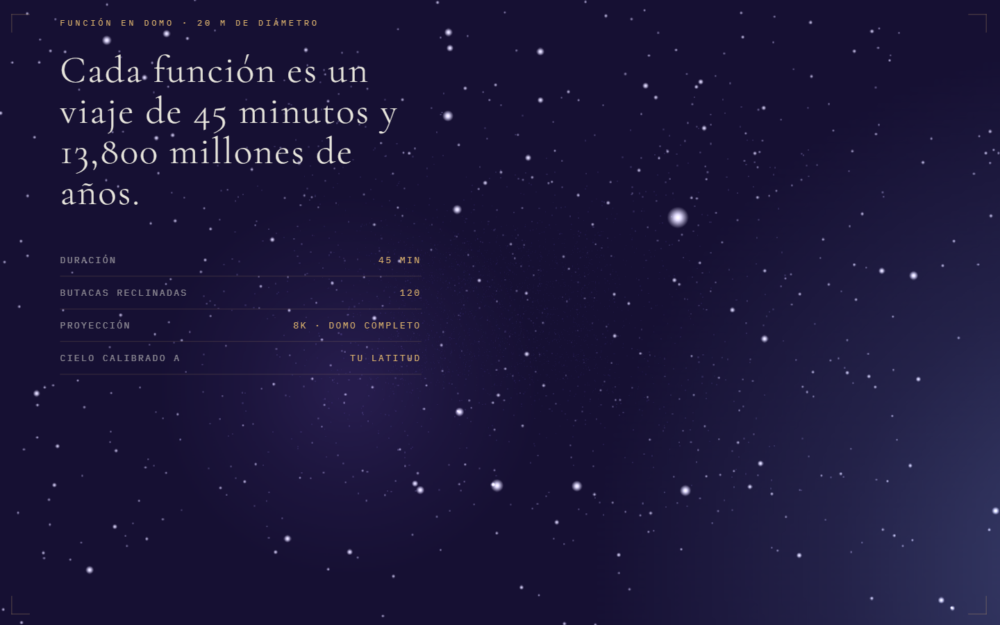

[Español](README.md) · **English**

# HALLEY - night planetarium

**Live demo → [https://angeljgc-dev.github.io/halley-planetario/](https://angeljgc-dev.github.io/halley-planetario/)**


Landing page for a night planetarium built on real WebGL: an endless starfield, a moon with a Fresnel glow and rings, and animated orbits. The astronomical show starts the moment you scroll.

| Hero | Section |
| --- | --- |
|  |  |

## Techniques

- **Three.js via importmap (ESM)** running next to global GSAP: a `THREE.Points` starfield with infinite z-recycling, a textured moon plus a Fresnel shader for the glow, and region-based fog.
- MotionPath for the orbits. One gotcha I left documented: `convertToPath` turns the `ellipse` into a `path`, so element-type CSS selectors stop matching it.
- ScrambleText on the astronomical figures, constellations drawn with `stroke-dasharray`, a magnetic button, and an eclipse transition done with transform only.
- Textures load with CORS open (Pexels images work straight as WebGL textures).

## Running locally

```bash
npx http-server . -p 8080
```

You need a server: ES modules and textures won't load over `file://`.

## License

Released under the [MIT](LICENSE) license. HALLEY is a made-up brand for portfolio purposes, not a real planetarium; any resemblance is coincidental. Third-party assets (photos, videos and 3D models) keep their authors' original licenses, see Credits.

## Credits

Photography and textures: [Pexels](https://www.pexels.com) · lunar texture from threejs.org.

---
Ángel Josué García Canteros · [github.com/angeljgc-dev](https://github.com/angeljgc-dev)
